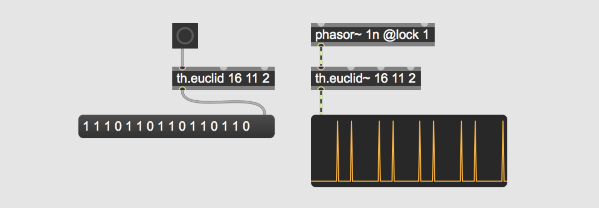

# th.euclid


## About

Two Max abstractions that generate euclidean musical rhythms. One outputs as a list of zeroes and ones, the other one is driven by a phasor~ and outputs clicks at signal rate. "The greatest common divisor of two numbers is used rhythmically giving the number of beats and silences, generating almost all of the most important World Music rhythms. The beats in the resulting rhythms are as equidistant as possible." The objects use a faster method to generate euclidean rhythms then the recursive method described in the paper, namely the Bresenham's Line Algorithm.

## Support my projects

**Consider to [name a fair price](http://gumroad.com/tmhglnd)**

**or [become a patron](http://patreon.com/timohoogland)**

## Sources used

- http://cgm.cs.mcgill.ca/~godfried/publications/banff.pdf

- https://en.wikipedia.org/wiki/Bresenham%27s_line_algorithm 

- https://github.com/brianhouse/bjorklund

## Install

Download zip
```
1. download zip
2. unzip and place in Max Searchpath (eg. MacOS ~/Documents/Max 8/Library)
3. restart Max8
```
Git clone
```
1. $ cd ~/Documents/Max\ 8/Library
2. $ git clone https://github.com/tmhglnd/th.euclid.git
3. restart Max8
```
```
4. Create a new object with "n" and type th.euclid or th.euclid~. Alt + Right-click to open the helpfile.
5. Read the helpfile for a detailed description.
```

# License

GNU Lesser General Public License v3.0

This program is distributed in the hope that it will be useful,
but WITHOUT ANY WARRANTY; without even the implied warranty of
MERCHANTABILITY or FITNESS FOR A PARTICULAR PURPOSE. See the
GNU General Public License for more details.